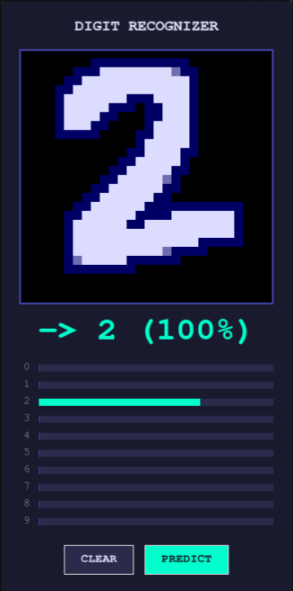
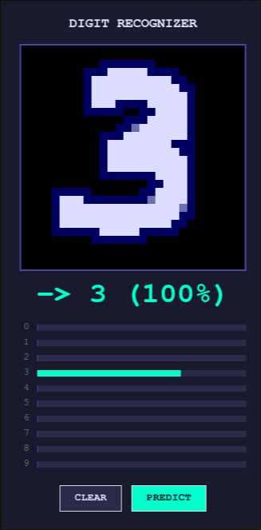

# Basic MNIST Digit Predictor using PyTorch

## How to Run 

Install dependencies using pip from the requirements.txt file. 

Trained model (20 epochs) from a part of the MNIST train data is present in the `data/` folder.

Model can be trained by running `src/train.py`, with batch size and everything adjustable. 

Run `src/main.py` for the actual GUI where digits can be drawn using the mouse and predicted via the model.

## Screenshots

